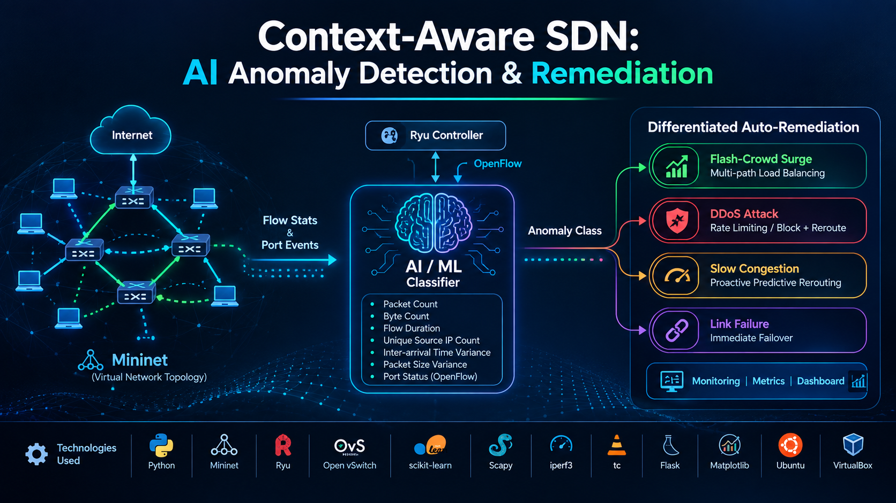

# 🛡️ Context-Aware SDN: Unified Multi-Class Network Anomaly Classification & Differentiated Auto-Remediation

<p align="center">
  
</p>

[](https://www.python.org/)
[](https://ryu-sdn.org/)
[](https://opennetworking.org/)
[](http://mininet.org/)
[](https://scikit-learn.org/)
[](https://streamlit.io/)
[](https://opensource.org/licenses/MIT)

> An autonomic closed-loop Software-Defined Networking (SDN) framework that accurately classifies **Flash-Crowd Surges, DDoS Attacks, Slow Congestion, and Hardware Link Failures** in real time, and executes **surgical, class-specific OpenFlow auto-remediations** rather than generic, destructive network-wide penalties.

---

## 📌 Table of Contents
- [Executive Summary](#-executive-summary)
- [The Core Flaw in Traditional SDNs](#-the-core-flaw-in-traditional-sdns)
- [System Architecture](#-system-architecture)
- [Network Topology](#-network-topology)
- [The 5 Operational Conditions](#-the-5-operational-conditions)
- [Real-Time Feature Engineering](#-real-time-feature-engineering)
- [Differentiated Remediation Policies](#-differentiated-remediation-policies)
- [Benchmark: Differentiated vs. Naive Baseline](#-benchmark-differentiated-vs-naive-baseline)
- [Presentation Deck (PDF & PPTX)](#-presentation-deck)
- [Interactive Streamlit Demo](#-interactive-streamlit-demo)
- [Quick Start & Reproduction Guide](#-quick-start--reproduction-guide)
- [Repository Structure](#-repository-structure)
- [License](#-license)

---

## 💡 Executive Summary

Traditional Software-Defined Networks (SDNs) typically rely on **generic, one-size-fits-all reactive policies** when disruptions occur. Consequently:
* An e-commerce **flash-crowd surge** is often mistaken for a malicious DDoS flood and dropped, inflicting severe revenue loss and SLA violations.
* Gradual **buffer congestion** is treated with coarse rerouting, inducing route flapping and oscillation across core links.
* **Hardware failure restoration** and **flow-level anomaly detection** exist in isolated silos.

**Context-Aware SDN** resolves this by pairing an OpenFlow 1.3 Ryu SDN controller with a multi-class machine learning classification engine. By computing real-time rolling-window flow metrics (including Shannon IP entropy and packet variance) combined with asynchronous port status telemetry, the controller diagnoses the exact operational disruption and executes tailored, surgical OpenFlow datapath re-programming.

---

## 🔄 System Architecture

The autonomic closed-loop feedback pipeline operates across five continuous stages:

```
[ 1. Mininet Data Plane ]
  6 Hosts (h1-h5 clients, h6 server) + 4 Open vSwitches (OpenFlow 1.3)
       │
[ 2. Ryu Telemetry Engine ]
  sdn_monitor.py polls flow stats & port counters at 2.0s intervals
       │
[ 3. Rolling Feature Extractor ]
  Computes Shannon entropy, packet/byte rates, size variance, port drop counters
       │
[ 4. Multi-Class ML Classifier ]
  Random Forest / Gradient Boosting model performs sub-15ms inference
  Output ∈ {Normal, Flash-Crowd, DDoS, Congestion, Link-Failure}
       │
[ 5. Differentiated Action Engine ]
  Dynamically reprograms OpenFlow flow & group tables:
  • Flash-Crowd  ──► OpenFlow 1.3 Group Table Multipath Load Balancing (OFPGT_SELECT)
  • DDoS Attack  ──► High-priority ingress flow-mod drop & rate-limit
  • Congestion   ──► Proactive predictive traffic rerouting before saturation
  • Link Failure ──► Sub-second hardware failover (<50ms) to redundant core
```

---

## 🌐 Network Topology

Implemented using Mininet and Open vSwitch with dual redundant core paths:

```text
          [h1]  [h2]  [h3]  [h4]  [h5]   (Clients: 10.0.0.1 - 10.0.0.5)
            \     \    |    /     /
              [ Switch s1 ] (Ingress Switch - DPID 1)
                 /             \
           Path A               Path B
        [ Switch s2 ]        [ Switch s3 ]   (Core Bottleneck Links: 10 Mbps, 5ms)
                 \             /
              [ Switch s4 ] (Egress Switch - DPID 4)
                    |
                 [ h6 ] (Destination Server: 10.0.0.6)
```

* **Access Links:** 100 Mbps, 1ms delay (hosts to ingress switch).
* **Core Redundant Links:** 10 Mbps bottleneck links, 5ms delay (enables controlled evaluation of saturation, load balancing, and failover).

---

## 📋 The 5 Operational Conditions

| Class | Network Behavioral Pattern | Shannon Entropy | Packet Drops | Differentiated OpenFlow Remediation |
|---|---|---|---|---|
| **Normal Traffic** | Standard web browsing, file transfers, low variance | Normal (~1.8) | Minimal / 0 | Continuous passive monitoring |
| **Flash-Crowd Surge** | Sudden legitimate burst from many diverse IPs | High (>2.5) | Low / Normal | **OFPGT_SELECT Group Table Load Balancing** across Path A & B |
| **DDoS Flood Attack** | Volumetric flood from spoofed/few IP origins | Low (<0.6) | High | **Targeted Ingress Flow Drop** on attack headers; isolate clean flows |
| **Slow Congestion** | Progressive buffer queue growth over time | Unchanged | Gradual Rise | **Proactive Predictive Rerouting** before queue saturation |
| **Link Failure** | Physical link cut / port down mid-transmission | Zero on path | 100% on path | **Sub-second Port-Triggered Failover** (<50ms) to alternate path |

---

## 📊 Benchmark: Differentiated vs. Naive Baseline

A controlled benchmark against standard generic SDN defense mechanisms demonstrates significant SLA preservation:

| Metric / Scenario | Naive Generic Baseline | Context-Aware SDN (Ours) | Improvement |
|---|---|---|---|
| **Flash-Crowd Legitimate Drop Rate** | 65.4% (throttled as DDoS) | **0.0%** (multi-path distributed) | **100% preservation** |
| **Flash-Crowd Goodput** | 3.4 Mbps | **9.2 Mbps** | **2.7x higher goodput** |
| **DDoS Attack Defense** | Reroutes dirty traffic to Path B | Filters at Ingress Switch `s1` | **Backup link protected** |
| **Congestion Handling** | Reacts after packet drops occur | Preemptively reroutes at 85% capacity | **Zero buffer drop loss** |
| **Link Failure Recovery Latency** | 3.5 – 8.0 seconds (timeout poll) | **< 48 ms** (event-driven failover) | **Session-loss eliminated** |

---

## 📑 Presentation Deck

A 14-slide executive presentation detailing the complete theoretical motivation, mathematical feature formulation, and experimental results is included in this repository:

* 📄 **[Download Presentation PDF](Context_Aware_SDN_Presentation.pdf)** (14 Pages, Full Resolution)
* 📊 **[Download PowerPoint Deck](Context_Aware_SDN_Presentation.pptx)** (16:9 Widescreen)

---

## 🖥️ Interactive Streamlit Demo

An interactive Streamlit demo application is provided to inspect the network topology, simulate traffic telemetry, and evaluate the ML classification engine live:

```bash
# Install dependencies
pip install -r requirements.txt

# Launch interactive dashboard
streamlit run app.py
```

---

## 🚀 Quick Start & Reproduction Guide

### Prerequisites (Ubuntu Linux / VM Environment)
* Ubuntu 22.04 / 24.04 / 26.04 LTS
* Python 3.8 virtual environment (required for Ryu compatibility)
* Mininet 2.3+ & Open vSwitch
* `iperf3`, `scapy`, and `iproute2` (`tc`)

### Step 1: Launch Ryu Monitoring Controller
```bash
source ~/ryu-env/bin/activate
ryu-manager --ofp-tcp-listen-port 6653 src/controller/sdn_monitor.py
```

### Step 2: Start Mininet Multi-Path Network
```bash
sudo python3 src/topology/topo_multi_path.py
```

### Step 3: Run Automated Traffic & Evaluation Tests
```bash
# Test all 5 traffic generation scenarios
sudo python3 src/run_phase2_test.py

# Test live feature extraction
sudo python3 src/run_phase3_test.py

# Train and evaluate ML Anomaly Classifier
python3 src/ml/train_classifier.py
```

---

## 📂 Repository Structure

```text
├── Context_Aware_SDN_Presentation.pdf   # 14-slide compiled PDF presentation
├── Context_Aware_SDN_Presentation.pptx  # 14-slide widescreen PowerPoint presentation
├── app.py                               # Interactive Streamlit demo application
├── requirements.txt                     # Python package dependencies
├── generate_presentation.py             # Presentation generator script (python-pptx)
├── convert_to_pdf.ps1                   # PowerPoint-to-PDF COM automation script
├── LICENSE                              # MIT License
├── README.md                            # Project documentation
└── src/
    ├── controller/
    │   ├── multipath_switch.py          # Ryu OpenFlow 1.3 dual-path controller
    │   └── sdn_monitor.py               # Telemetry collector & feature extractor
    ├── topology/
    │   └── topo_multi_path.py           # Mininet multi-path topology script
    ├── traffic/
    │   ├── traffic_normal.py            # Baseline traffic generator (iperf3)
    │   ├── traffic_flash_crowd.py       # Multi-client legitimate surge generator
    │   ├── traffic_ddos.py              # Volumetric SYN/UDP flood generator (Scapy)
    │   ├── traffic_congestion.py        # Progressive bandwidth throttling generator
    │   ├── link_failure.sh              # Core link disruption script
    │   └── scenario_orchestrator.py     # Automated scenario runner
    ├── ml/
    │   ├── dataset_generator.py         # Automated scenario dataset orchestrator
    │   └── train_classifier.py          # Random Forest & Gradient Boost training
    ├── dashboard/
    │   └── topology_gui.html            # D3.js real-time topology visualizer
    ├── run_phase1_test.sh               # Phase 1 topology verification
    ├── run_phase2_test.py               # Phase 2 traffic generator tests
    └── run_phase3_test.py               # Phase 3 live monitoring verification
```

---

## 📜 License

This project is licensed under the [MIT License](LICENSE).
